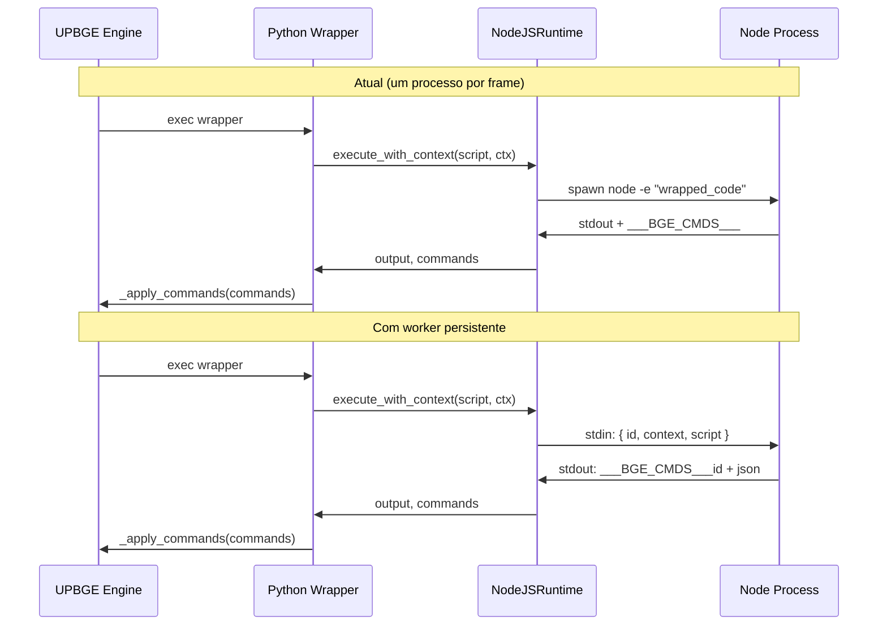

# Plano: API bge.d.ts completa + estratégia de performance da bridge

## Estado atual vs bge.d.ts

O contrato em [types/bge.d.ts](types/bge.d.ts) define: `bge.logic` (getCurrentScene, getSceneList, getScene, getCurrentController, getCurrentObject, getKeyboardInput, getMouseInput, getJoystickInput, getGameEngine), `Scene` (name, active, objects, getObject, addObject, removeObject), `GameObject` (name, position, rotation, scale, getProperty, setProperty, getParent, setChildren), `Controller`, `KeyboardInput`, `MouseInput`, `JoystickInput`, `GameEngine` (getFrameRate, getCurrentFrame, getTimeSinceStart, endGame, restartGame), `bge.types.Vector3`.

**Já implementado:** position (get/set), applyMovement, setProperty, getProperty, setParent, getParent (sempre null), getChildren ([]), getObject(name), getCurrentScene, getSceneList (retorna uma cena só), getScene(name), getCurrentController/getCurrentObject, input stubs (keyboard/mouse/joystick), GameEngine getters e endGame/restartGame (só no proxy; Python não aplica), Vector3. **Contexto:** scene_name, object_name, position, properties, children, scenes, keyboard (parcial), mouse/joystick/engine parciais.

**Faltando ou incompleto:**

- **GameObject:** rotation e scale (get/set) no proxy e comandos `setRotation`, `setScale` em [script_handler.py](python/game_engine/script_handler.py); getChildren preenchido a partir de `ctx.children`; getParent preenchido se houver `parent_name` no contexto.
- **Scene:** getSceneList retornar array de cenas a partir de `ctx.scenes` (nome + lista de nomes de objetos); `scene.objects` como array de GameObjects; addObject/removeObject como comandos + aplicação em Python.
- **GameEngine:** comandos `endGame` e `restartGame` tratados em `_apply_commands` (chamar `bge.logic.endGame()` / `restartGame()`).
- **Contexto:** incluir rotation, scale, parent_name, engine (current_frame, time_since_start), e garantir teclado/mouse/joystick preenchidos em [python_wrapper.py](python/game_engine/python_wrapper.py) (`_build_context`).

---

## Parte 1: Implementação passo a passo da API (bge.d.ts)

### Fase 1 – Contexto (python_wrapper)

- Em `_build_context()` em [python_wrapper.py](python/game_engine/python_wrapper.py):
  - Incluir **rotation** e **scale** do owner (worldOrientation → Euler ou quaternion serializável; worldScale) como listas `[x,y,z]`.
  - Incluir **parent_name** (nome do objeto pai, se houver).
  - Preencher **engine**: `current_frame` (ex.: `logic.getCurrentFrame()` se existir), `time_since_start` (ex.: `logic.getTimeSinceStart()`), além de `frame_rate`.
  - Garantir **mouse.position** (e botões/wheel) a partir dos sensors/eventos quando possível.
  - Garantir **joystick** (count, buttonsPressed, axes) quando houver API disponível no BGE.

### Fase 2 – GameObject: rotation, scale, getChildren, getParent

- **Proxy** em [nodejs.py](python/runtime/nodejs.py) (`__bgeMakeGameObject`):
  - Adicionar getters/setters para **rotation** e **scale** (ler de `ctx.rotation` / `ctx.scale` quando `object_name === objName`; setter enfileirar `setRotation` / `setScale` com `value` [x,y,z] ou equivalente).
  - **getChildren()**: retornar `(ctx.children || []).map(name => __bgeMakeGameObject(name))`.
  - **getParent()**: se `ctx.parent_name` existir, retornar `__bgeMakeGameObject(ctx.parent_name)`; senão null.
- **Comandos e Python:** em `_apply_commands` em [script_handler.py](python/game_engine/script_handler.py):
  - Tratar `op == "setRotation"`: aplicar ao objeto (ex.: worldOrientation ou rotation em Euler conforme API BGE).
  - Tratar `op == "setScale"`: aplicar worldScale ou scale.
- **Contexto:** já coberto na Fase 1 (rotation, scale, parent_name, children).

### Fase 3 – Scene: getSceneList, objects, getObject, addObject, removeObject

- **Proxy** em [nodejs.py](python/runtime/nodejs.py):
  - **getSceneList()**: retornar `(ctx.scenes || []).map(s => __bgeMakeScene(s.name))`, onde cada cena tem `objects: s.objects.map(name => __bgeMakeGameObject(name))` (ou equivalente usando lista de nomes em `s.objects`).
  - **__bgeMakeScene(name)**:
    - Para a cena atual (`name === ctx.scene_name`), preencher `objects` a partir de `ctx.scenes` (objeto da cena atual) ou de um campo dedicado no contexto com lista de nomes de objetos da cena.
    - **getObject(name)** já existe; garantir que funcione para qualquer nome vindo de `objects`.
  - **addObject(object)**: enfileirar comando `{ op: "sceneAddObject", scene: sceneName, object: object.name }` (ou objeto mínimo necessário).
  - **removeObject(object)**: enfileirar `{ op: "sceneRemoveObject", scene: sceneName, object: object.name }`.
- **Python:** em `_apply_commands`:
  - Tratar `sceneAddObject` e `sceneRemoveObject` usando a API da cena (ex.: `scene.addObject(...)` / `scene.unlink(...)` ou equivalente no BGE).

### Fase 4 – GameEngine: endGame, restartGame

- Em [script_handler.py](python/game_engine/script_handler.py) em `_apply_commands`:
  - Para comandos sem `object` (ou com `op` global): tratar `op == "endGame"` chamando `logic.endGame()` e `op == "restartGame"` chamando `logic.restartGame()` (ou equivalente no módulo logic do BGE).
  - Manter compatibilidade com comandos por objeto (não exigir `object` para esses dois ops).

### Fase 5 – Input e Engine (revisão)

- Validar que **keyboard** (pressed, justPressed, justReleased) está preenchido em `_build_context` a partir dos sensors do controller (já iniciado no wrapper).
- Completar **mouse** (position, pressed, justPressed, justReleased, wheelDelta) e **joystick** (count, buttonsPressed, axes) onde a API BGE permitir.
- Garantir que **engine** (frame_rate, current_frame, time_since_start) está sempre preenchido para que getFrameRate, getCurrentFrame, getTimeSinceStart no proxy retornem valores corretos.

### Fase 6 – Ajustes e tipos

- Alinhar **Controller** no proxy com bge.d.ts (name, type, active); manter `owner` como extensão útil.
- Confirmar que **bge.types.Vector3** no proxy (add, subtract, multiply, length, normalize) está conforme d.ts.
- Corrigir bug de duplicata `elif op == "setPosition"` em [script_handler.py](python/game_engine/script_handler.py) (há dois blocos iguais; manter um e remover o duplicado).
- Resolver obtenção de cena em `_apply_commands`: usar `logic.getScene(scene_name)` quando houver, ou iterar `logic.getSceneList()` para achar por nome, em vez de `getSceneList()[scene_name]` (que assume índice por nome e pode falhar conforme a API).

---

## Parte 2: Estratégia de performance da bridge

Objetivo: reduzir custo por frame (evitar spawn de processo a cada execução e minimizar serialização).

### 2.1 Worker persistente (prioridade alta)

- Manter **um processo Node por sessão de jogo** em vez de um `subprocess.run` por frame.
- Fluxo: ao primeiro controller JS, **iniciar** o processo com um script “worker” que:
  - lê mensagens por **stdin** (uma linha JSON por execução: `{ id, context, script }`);
  - avalia o script com o contexto injetado (`__BGE_CONTEXT__`, `bge`);
  - escreve em **stdout** uma linha por resposta: `___BGE_CMDS___<id><json array>` (ou formato único que permita associar resposta ao request por `id`).
- Em [nodejs.py](python/runtime/nodejs.py): nova classe ou modo `NodeJSRuntime(use_worker=True)` que:
  - inicia o worker uma vez (subprocess.Popen com stdin=PIPE, stdout=PIPE);
  - por execução: envia `{ "id": frame_id, "context": context, "script": user_code }`, lê até a linha com `___BGE_CMDS___`, extrai comandos e devolve ao script_handler;
  - trata encerramento do processo (jogo termina) e reconexão se o worker morrer.
- [script_handler.py](python/game_engine/script_handler.py) continua chamando `runtime.execute_with_context(...)`; a mudança fica interna ao runtime (execução via worker em vez de `-e` por frame).

### 2.2 Cache de script (prioridade média)

- Se o **texto do script** não mudar entre frames (mesmo controller, mesmo datablock), não reenviar o script inteiro ao worker; enviar apenas **contexto** e um **script_id** (hash ou nome).
- No worker: manter um mapa `script_id -> função compilada`; quando receber só script_id + context, reutilizar a função e executar com o novo contexto.
- Reduz parsing/compilação no Node a cada frame.

### 2.3 Contexto enxuto (prioridade média)

- Opção **configurável** ou heurística: enviar no contexto apenas o que o script usa (ex.: se não chama getMouseInput, não enviar `mouse`).
- Alternativa: formato mais compacto que JSON (ex.: MessagePack) para contexto e comandos, se a serialização aparecer como gargalo em profiling.

### Ordem sugerida de implementação da performance

1. Worker persistente (maior ganho).
2. Cache de script no worker.
3. Contexto enxuto ou formato compacto (após medir).

---

## Ordem geral de execução

- **Parte 1 (API):** Fases 1 → 2 → 3 → 4 → 5 → 6 (cada fase testável com exemplos existentes ou pequenos scripts).
- **Parte 2 (performance):** 2.1 (worker) primeiro; depois 2.2; 2.3 e 2.4 conforme necessidade.

## Arquivos principais

| Arquivo | Alterações |

|--------|------------|

| [python/game_engine/python_wrapper.py](python/game_engine/python_wrapper.py) | _build_context: rotation, scale, parent_name, engine completo, mouse/joystick |

| [python/runtime/nodejs.py](python/runtime/nodejs.py) | Proxy: rotation, scale, getChildren, getParent; Scene: getSceneList, objects, addObject, removeObject; depois worker persistente + cache |

| [python/game_engine/script_handler.py](python/game_engine/script_handler.py) | _apply_commands: setRotation, setScale, endGame, restartGame, sceneAddObject, sceneRemoveObject; obter cena por nome; remover duplicata setPosition |

## Diagrama do fluxo atual vs com worker

