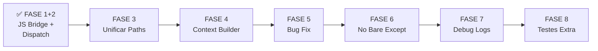

# 🛣️ Roadmap de Refatoração - Fases 3-8

## Status Atual
✅ **FASE 1** - JS Bridge Extraído  
🔄 **FASE 2** - Dispatch Pattern em Progresso  
📋 **FASES 3-8** - Planejadas  

---

## FASE 3: Unificar `get_sdk_path` e Detecção de Plataforma

### Problema
Lógica de resolução de caminhos duplicada em **4 arquivos**:
- `__init__.py` - função `get_sdk_path()` (linhas ~133)
- `python/runtime/nodejs.py` - função `get_sdk_path()` (linhas ~26) e `get_node_path()` (linhas ~57)
- `scripts/setup_sdk.py` - função `get_node_path()` (linhas ~36)
- `scripts/download_dependencies.py` - função `get_platform()` (linhas ~50)

### Solução
Criar módulo centralizado `python/utils/paths.py` com:
```python
def get_sdk_root(context=None) -> str:
    """Get SDK root path with fallback chain"""
    
def get_node_executable() -> Optional[str]:
    """Get path to Node.js executable"""
    
def get_platform() -> str:
    """Detect platform: Windows, Darwin, Linux"""
    
def resolve_sdk_path(base_path: str) -> str:
    """Resolve SDK path for current OS"""
```

### Arquivos a Modificar
1. Criar `python/utils/__init__.py`
2. Criar `python/utils/paths.py` com funções centralizadas
3. Atualizar `__init__.py` para usar `from python.utils.paths import ...`
4. Atualizar `python/runtime/nodejs.py` para usar `from python.utils.paths import ...`
5. Atualizar `scripts/setup_sdk.py` para usar `from python.utils.paths import ...`
6. Atualizar `scripts/download_dependencies.py` para usar `from python.utils.paths import ...`

### Testes
Criar `tests/test_paths.py` com:
- `test_get_sdk_root_with_env` - Usar `UPBGE_SDK_PATH`
- `test_get_sdk_root_fallback` - Detectar automaticamente
- `test_get_node_executable_windows` - Mock Windows
- `test_get_node_executable_macos` - Mock macOS
- `test_get_node_executable_linux` - Mock Linux
- `test_get_platform_detection` - Cada plataforma

---

## FASE 4: Converter `python_wrapper.py` em Módulo Importável

### Problema
Template Python como string (~460 linhas):
- `python_wrapper.py` contém `WRAPPER_CODE_TEMPLATE`
- Template com duplo escaping de chaves
- Função `_build_context()` como string Python
- Impossível testar, debugar, ou reformatar

### Solução
1. Extrair `_build_context()` para função real em `python/game_engine/context_builder.py`
2. Template passa a usar import real em vez de string
3. Setup script importa e serializa normalmente

### Estrutura
```python
# python/game_engine/context_builder.py
def build_context(scene, owner, controller_name=None) -> dict:
    """Build BGE context JSON for Node.js bridge"""
    return {
        "scene_name": scene.name,
        "object_name": owner.name,
        "controller_name": controller_name,
        "position": list(owner.worldPosition),
        "rotation": list(owner.worldOrientation),
        # ... etc
    }
```

### Arquivos a Modificar
1. Criar `python/game_engine/context_builder.py`
2. Refatorar `python_wrapper.py` para usar import real
3. Remover template string duplo-escaping

### Testes
Criar `tests/test_context_builder.py` com:
- `test_build_context_basic` - Contexto básico
- `test_build_context_with_properties` - Propriedades customizadas
- `test_context_serializable` - Serializável a JSON

---

## FASE 5: Corrigir Bug do Unregister

### Problema
`game_engine/__init__.py` linhas 47-57:
```python
def unregister():
    ui = sys.modules.get("ui")  # ❌ Errado! Deveria ser "game_engine.ui"
    ui.unregister()  # ❌ Crash: AttributeError
```

### Solução
Usar nomes corretos:
```python
def unregister():
    ui = sys.modules.get("game_engine.ui")
    script_handler = sys.modules.get("game_engine.script_handler")
    controller = sys.modules.get("game_engine.controller")
    
    if ui:
        ui.unregister()
    if script_handler:
        script_handler.unregister()
    if controller:
        controller.unregister()
```

### Testes
- `tests/test_addon_unregister.py` (precisa rodar em contexto Blender real)

---

## FASE 6: Eliminar Bare Excepts

### Problema
9 ocorrências de `except:` sem tipo:
- `__init__.py`: linhas 67, 73
- `python/preferences.py`: linha 38
- `python/runtime/nodejs.py`: linhas 35, 51, 91
- `python/console/javascript.py`: linhas 102, 248
- `scripts/setup_sdk.py`: linha 96

### Solução
Substituir por `except Exception:` com logging apropriado:
```python
# ANTES
except:
    pass

# DEPOIS
except Exception as e:
    _log(f"Warning: {e}")
    # ou leave empty if truly ignorable
    pass
```

### Arquivos a Modificar
1. `__init__.py`
2. `python/preferences.py`
3. `python/runtime/nodejs.py`
4. `python/console/javascript.py`
5. `scripts/setup_sdk.py`

### Benefícios
- KeyboardInterrupt não é capturado silenciosamente
- SystemExit não é capturado
- Melhor debugging

---

## FASE 7: Controlar Logs de Debug

### Problema
Flags de debug SEMPRE ligadas em produção:
- `DEBUG_BRIDGE_LOGS = True` em `script_handler.py` (linha 27)
- `DEBUG_NODE_LOGS = True` em `nodejs.py` (linha 18)
- Blocos de debug JS inline em `bge_bridge.js` (linhas ~450+)
- Output poluído em produção

### Solução
1. Adicionar config de logging proper com `logging` module
2. Padrão: `DEBUG_*` = `False` por default
3. Permitir controle via preferences ou env var
4. Remover/condicionalizar debug logs do JS

### Implementação
```python
# python/utils/logging.py
import logging
import os

def get_logger(name, debug=False):
    logger = logging.getLogger(name)
    level = logging.DEBUG if debug else logging.INFO
    logger.setLevel(level)
    return logger

# Uso
DEBUG = os.getenv("UPBGE_JS_DEBUG", "0") == "1"
_log = get_logger("upbge.js", debug=DEBUG)
```

---

## FASE 8: Adicionar Suite de Testes Expandida

### Estado Atual
✅ 41 testes para funções críticas

### O que Adicionar
1. **Testes de Integração** - script_handler com mocks mais realistas
2. **Testes de Paths** - `test_paths.py` para FASE 3
3. **Testes de Context** - `test_context_builder.py` para FASE 4
4. **Testes de Unregister** - `test_addon_unregister.py` para FASE 5
5. **Performance Tests** - `test_performance.py` para overhead de handlers

### Cobertura Meta
- Linha: ~80%+ de cobertura
- Branches: ~70%+ de cobertura
- Todos os handlers testados isoladamente

---

## Ordem de Execução Recomendada



### Timeline Estimado
- **FASE 3**: 30 min (refactor simples, muito teste)
- **FASE 4**: 45 min (template string é chato)
- **FASE 5**: 5 min (fix trivial)
- **FASE 6**: 15 min (find/replace + test)
- **FASE 7**: 30 min (logging setup)
- **FASE 8**: 45 min (novos testes)

**Total: ~2.5 horas** para todas as refatorações

---

## Checklist Final

Após completar todas as 8 fases:

- [ ] Todos os 80+ testes passando
- [ ] Cobertura > 80%
- [ ] Sem duplicação de código
- [ ] Sem bare excepts
- [ ] Sem f-strings complexas
- [ ] Sem templates de string
- [ ] Logging limpo e controlável
- [ ] Todas as funções testáveis isoladamente
- [ ] Código pronto para PR/merge
- [ ] README atualizado com architecture

---

**Próximas Ações:**
1. ⏳ Aguardar conclusão da FASE 2 (agente trabalhando)
2. ✅ Executar FASE 3 quando FASE 2 estiver done
3. 📋 Seguir roadmap para FASES 4-8
